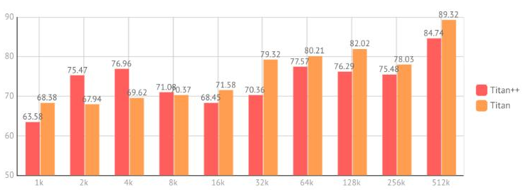
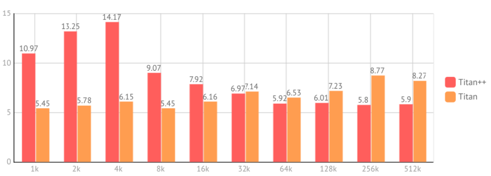
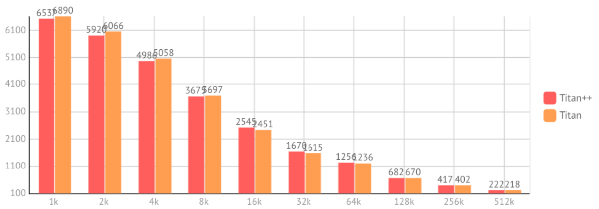
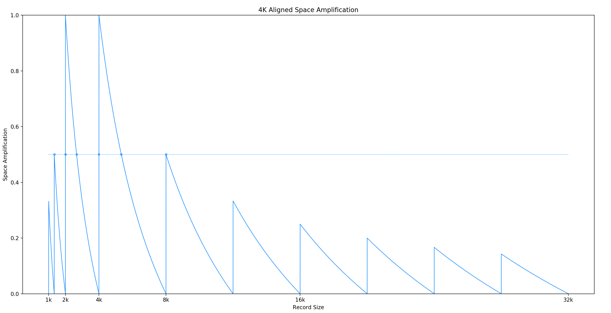
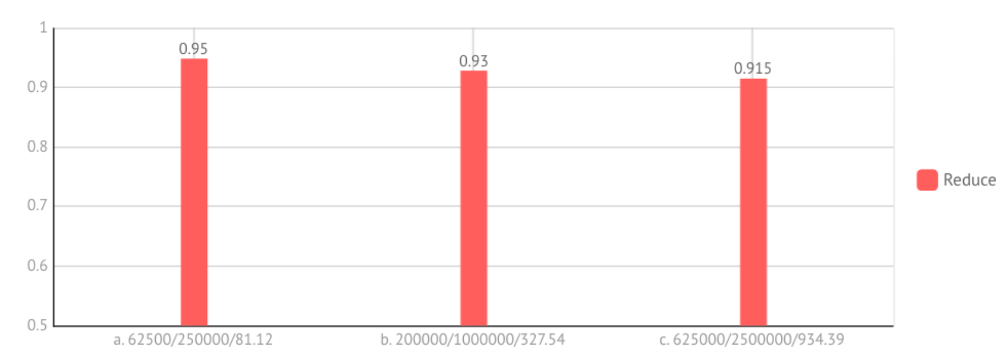

# Proposal: Reduce Write Amplification By Modifying Garbage Collection Of Titan

- Author(s):    
  -  WenJun Huang [WjHuang](https://github.com/wjhuang2016)
  -  Ning Lin [NingLin-P](https://github.com/NingLin-P)
  -  Hanyang Liu [lhy1024](https://github.com/lhy1024)
- Last updated:  2019/08/04

## Abstract

By using technique call hole-punching, we redesign the garbage collection (GC) process in Titan, to further reduce write amplification on GC

## Background

### Write amplification in TiKV

As a distributed transaction key-value database, TiKV use raft consensus protocol to provide high availability and use RocksDB as the underlying storage engine. While these components work fine 
together and provide high performance, there still has a problem that reduces IO throughput and consume CPU and disk resource, that is the write amplification problem. As we observed, while 
writing key-value pairs to TiKV, write amplification happen in the following places: 

- Raft logs. In raft consensus protocol a peer must first persist the raft logs after received an raft logs, and when these logs had committed later, a peer also needs to apply these log to its state machine, in TiKV that procedure will be written to RocksDB.
- Write ahead log to level 0 SSTable. When RocksDB received a update operation, it first write that operation to its write ahead log, and later when it flush memtable to disk, it will again need to write (some of) these operations to the level 0 SSTables.
- LSM tree compaction. Within LSM tree, SSTables are organized at many levels, when a SSTables from upper level flow to lower level, the SSTables in lower level whose key range are overlapped with that SSTable, will need to read, merge sort and writes back again to disk.

As persist raft logs are part of the raft consensus protocol to provide its correctness, it is a bit hard to remove or improve write amplification on it. But in LSM tree, as it's widely used to 
build storage engine, there are so many efforts had been made to reduce write amplification on LSM tree, and so far we had read some papers in this feed:

- Key value separation: WiscKey, HashKV.
- Delay compaction: PebblesDB, dCompaction, TRIAD-DISK in TRIAD, Universal compaction (build-in on RocksDB).
- Hot cold separation: TRIAD-MEM in TRIAD, HashKV.
- Transform WAL into SSTable: TRIAD-LOG in TRIAD.

Although RocksDB export rich interfaces and tuning parameters to allow users to customize RocksDB's behavior, it is still so hard to implement some ideas above by using RocksDB's interface without modifying its internal and that is a non-trivial work.

Instead, as we know, Titan is a RocksDB plugin implement by using RocksDB's interface, inspired by WiscKey for key-value separation, which aims to reduce write amplification in RocksDB with large values when compaction.

Titan uses a value storage for large values, and need to periodic garbage collection (GC) to reclaim space occupied by stale value in the blob file. But during garbage collection (GC), it merges the valid data in the blob file and writes it to disk on new blob files, and also writing the new location information for those valid records back to LSM tree.

And this introduces new write amplification: Even if some records are valid, we need to rewrite them to disk. In other words, though Titan reduces write amplification of the LSM tree by reducing the size of the LSM tree, it introduced new write amplification at the time of GC. We tried to reduce the write operations on disk to reduce this write amplification.

## Proposal

We propose a new garbage collection algorithm which further reduces the write amplification. In our new garbage collection algorithm, we reduce write amplification by trying to to minimize rewriting valid record to the disk by use a technique call hole-punching to actively reclaim disk space occupied by invalid records without the need of writing valid record to new blob files.In other words, we reduce the amount of space amplification to delay and reduce the GC to reduce write amplification.

### Concepts 

#### Dig Holes

To efficiently reclaim the free space of the blob files without writing to the disk, we use a technique called hole-punching(fallocate) provided by some modern file systems(such as ext4, xfs, btrfs). Punching a hole in a file can deallocate the physical space and keep the offset untouched. By doing this, we can not only reclaim the disk space, but also avoid writing the new offsets back to the lsm-tree. 

#### Two Stage GC

In addition to the direct compaction and write a valid record to new blob files like Titan did before, we perform hole-punching on blob files to reclaim disk space occupied by invalid records while leaving the valid records in the same position in blob files when performing Garbage Collection (GC). 
Thus, new GC is divided into two stages:

- First, we perform hole-punching on blob files whose discardable size exceed a given threshold, and prioritize takes files with larger discardable size.
- Second, we compaction and merge blob files whose size below a given threshold, and prioritize take files with smaller size.

We choose this greedy approach to select files to perform GC instead of use discardable ratio like Titan used to do, because in Titan it need to consider the disk space can reclaim (discardable size) and the valid records need to write back to disk. While in our approach, valid records will leave in the same position without the cost of writing back to disk, so we only need to reclaim disk space as much as we can. Since most of the disk space has been reclaimed by hole-punching, the resulting write amplification will be much lower than before.

#### 4K Alignment

With testing, we found that for data that are not 4k aligned, the punching hole will fill in the corresponding 0. 

    
  Figure 1: Punching Hole

Because the header data of the record may contain 0, such as 0000111111111111 and 1111111111110000, which leads to the inability to read the data correctly according to the past arrangement, so we take a 4k alignment, that is, if a record cannot be placed at the current block, it will use the next block.

### Overview

We will perform space reclamation through a two-stage GC, in which digging holes will significantly reduce write amplification.

### Change

- Blob file iterator
- Blob GC job
- Blob GC picker

### Positively influenced

- Write amplification. With a two-stage GC, this proposal will reduce write amplification.
- Reduction in LSM Tree writes. Since the offset does not change during the first phase of the GC, there is no need to write back to the LSM-tree. The reduction in LSM Tree writes both increases the speed of the GC and reduces the impact of the GC on the online business.

### Negatively influenced

- Slower read speed. Digging holes causes the records to become discontinuous, it will affect the speed of reading. However, considering that the record size of Titan is above 4k, the reading speed will not decrease much.
- Repeated digging holes. The API of fallocate will physically reclaim space only when the released space completely covers the block, usually 4k. In order to reclaim the free space of the cross-block, we had to choose to dig between the two valid records instead of  only one invalid record. This will result in repeated digging holes in the space.

## Rationale

1. Inside RocksDB(pro: good result, con: complex)
2. Put WAL and vlog together(badger) (pro: reduce WAL by 1, con: see Titan design)
3. Our design(pro: simple, reduce WA sharply in Update-intensive workload, con: change the immutable of blob file)
4. Incur unnecessary WA and affect performance during GC.

## Compatibility

It does not affect the compatibility with Linux. Unfortunately, the method, fallocate,  used in this proposal is limited to Linux 3.1, not to the broader system interface, such as POSIX.

## Implementation

### Dig Hole

- Who: Hanyang Liu [lhy1024](https://github.com/lhy1024)
- When: 7.23-8.12
- Step 1: Get input files after sample and parallel dig holes in files.
- Step 2: 
  We will foreach through all the records in a file and save the ending offset of the last valid record. If a new valid record is found, we will dig holes between the end offset of the last valid record and the start offset of the record.
  In addition to buffering the end offset of a valid record, we will also save the key of the previous record and whether it is valid, which will reduce access to the LSM-tree and reduce decoding with the record.

### File operation support

- Who: Wenjun Huang [WjHuang](https://github.com/wjhuang2016)
- When: 7.23-8.12
- Step 1: Implement a file class bases on PosixRandomRWFile provide by rocksdb and provides some functions, such as seek, punch_hole. 
- Step 2: Rewriter the blob file iterator to support reading from a blob file with holes. 

### Blob GC picker

- Who: Ning Lin [NingLin-P](https://github.com/NingLin-P)
- When: 7.23-8.12
- Step 1: according to the discardable size of each blob files, choose some files to perform hole-punching, and also choose blob files with small size to perform compaction like Titan
- Step 2: While in Titan blob files are immutable after writing finish and being selected to GC mean this blob file will be deleted soon, but in our approach this property no longer hold and hence we need to carefully rethink about the management of blob files, especially in case of concurrent operation.

## Evaluation

### Test Environment

- CPU: I5-8350u
- RAM: 24GB
- SSD: SAMSUNG 970Pro 512GB 

### Case 1: Different Record Size
#### Workload

- Operation: 100% update
- Value size: from 1K to 512K
- Record count: 4G/value size
- Operation count: 16G/value size
- Request distribution: uniform

#### Result

    
  Figure 2: Write Amplification

    
  Figure 3: Space Amplification

    
  Figure 4: OPS

#### Analysis

We can see that in both cases of 2k and 4k, the use of hole punching instead introduces a larger write amplification. Because we use 4k alignment to process data, which leads to the storage of one such record need more blocks to be filled zero. And the data we write is not exactly 2k or 4k, considering the head and key. In fact, it is just a little bigger than 2k or 4k. 

Space amplification function is.

    
  Figure 5: Space amplification function

We can know the space amplification ratio of 2049\~2730 and 4097\~5461 are larger than 0.5, which will make larger space. Our test will approve it, the case of 2k and 4k, we write more zero data and in the case of 8k their write amplification are close.

In theory, because Sample and reduction of rewrite LSM from GC, OPS should have improvement, but the test shows that the OPS of the two is close. We suspect that the strategy of punching hole may be somewhat radical, so it make frequent scheduling. We have reason to believe that OPS will have better optimizations when adjusting option.

### Case 2: Different Write Size

#### Workload

- Operation: 100% update

- Value size: 64k

- Request distribution: uniform

#### Result  

    
  Figure 6: Reduce

- x : Record size/Operation size/Titan Write Size
- y : Titan++ Size/Titan Size

#### Analysis

As the size of the data increases, Titan's GC is increasing. At the same time, Titan++ only needs to increase the corresponding punching hole, so the optimization of write amplification is more and more significant.

## Open issues (if applicable)

None
